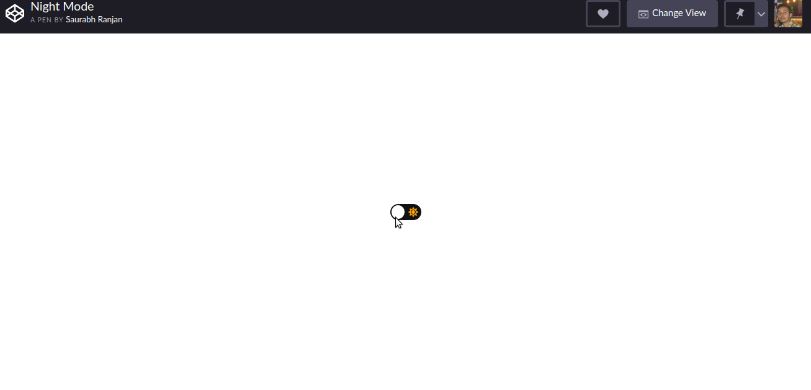

# My small random projects!

## Custom Progress Bar with CSS and JavaScript

A progress bar is made using css and js.

[Check it Working](https://codepen.io/inrsaurabh/pen/bGdjvoN?editors=1001)

##  Don't Laugh Challenge

Random joke generator using css and js.

[API](https://icanhazdadjoke.com/)

[Check it Working](https://codepen.io/inrsaurabh/pen/GRJBbgY)

##  Tweet Poster

A simple Tweet Poster app built using React.

[API](https://thesimpsonsquoteapi.glitch.me/quotes)

Hosted On [Netlify](https://www.netlify.com/)

[Check it Working](https://react-tweet-poster.netlify.com/)

[Repo](https://github.com/maddyBoy/react-tweet-poster/)

##  Dark Mode

Dark Mode using css and Js.

[Check it Working](https://codepen.io/inrsaurabh/pen/yLNxXgY)

